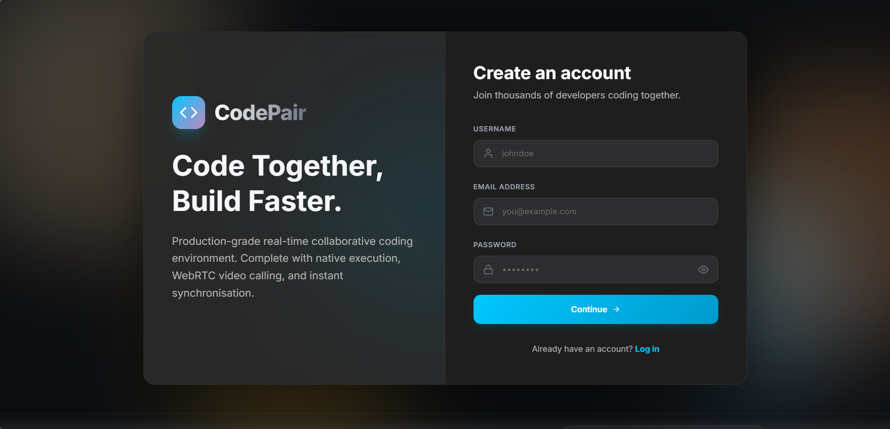
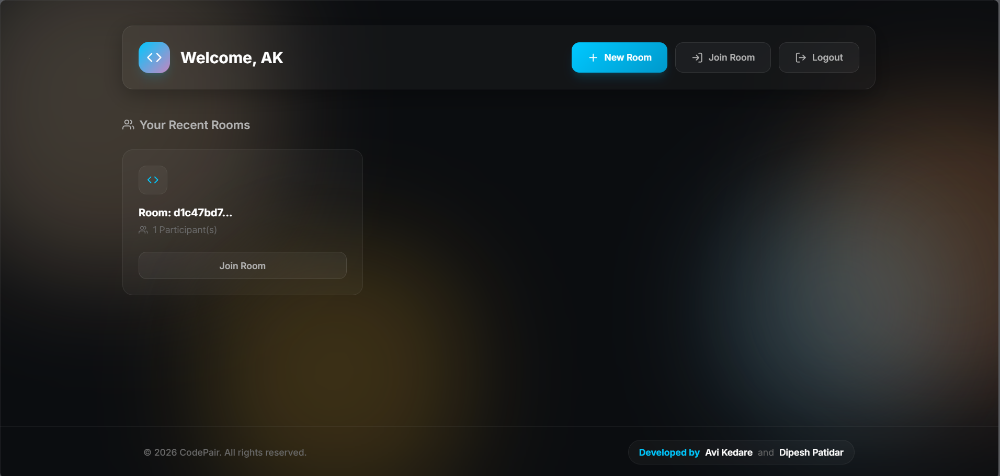
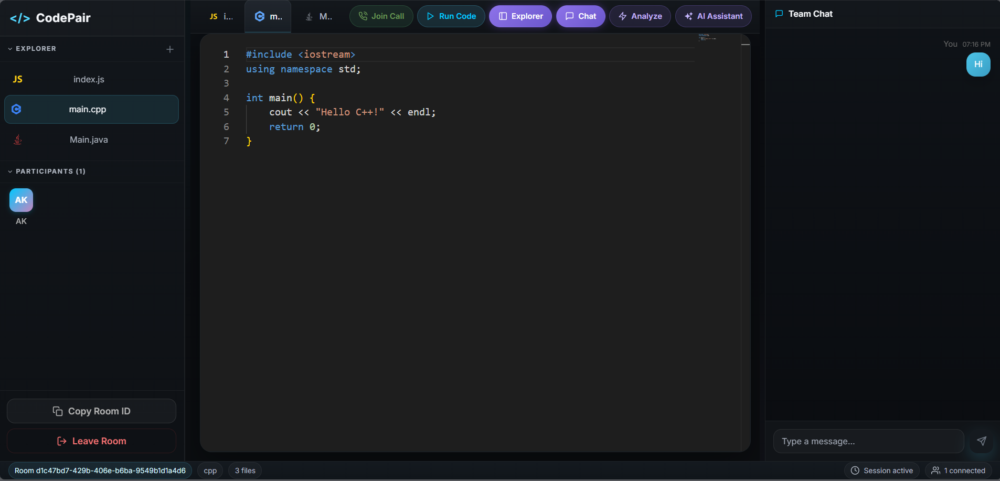

# CodePair – Real-Time Collaborative Code Editor

CodePair is a modern real-time collaborative coding platform designed for developers, students, and teams. It combines a VS Code-inspired workspace with live collaboration, integrated communication tools, AI-powered assistance, and multi-language code execution.

---

## 📖 Overview

CodePair enables multiple developers to work together in a shared coding environment. Users can collaborate in real time, communicate through built-in video/audio calls, execute code instantly, and leverage AI assistance—all from a single workspace.

---

## 📸 Screenshots

### Login Screen



Secure authentication system for accessing coding rooms and project workspaces.

### Dashboard



Manage, create, and join collaborative coding sessions.

### Workspace



A complete development environment featuring:

* Monaco Code Editor
* File Explorer
* Output Terminal
* Team Chat
* AI Assistant
* Video/Audio Calling

---

## ✨ Key Features

### 🔄 Real-Time Collaboration

* Live code synchronization using WebSockets
* Multi-user editing support
* Instant updates across all participants

### 💻 Multi-Language Code Execution

Run code securely in:

* JavaScript
* Python
* C++
* Java

### 🎥 Integrated Communication

* WebRTC-based video calls
* Audio communication
* Screen collaboration experience

### 🤖 AI-Powered Assistant

* Code suggestions
* Complexity analysis
* Bug detection support
* AI chat assistance

### 📁 Workspace Management

* Create files and folders
* Rename resources
* Delete files
* Organized project structure

### 🎨 Premium Developer Experience

* VS Code-inspired interface
* Dark theme UI
* Responsive design
* Developer-focused workflow

---

## 🛠 Tech Stack

### Frontend

* React
* Vite
* Tailwind CSS
* Socket.IO Client
* WebRTC
* Monaco Editor

### Backend

* Node.js
* Express.js
* Socket.IO
* MongoDB
* Mongoose

### AI Integration

* Google Gemini
* OpenRouter

### Code Execution

* Railway-hosted isolated execution service

---

## 🚀 Installation & Setup

### Prerequisites

Make sure you have installed:

* Node.js (v18+ recommended)
* npm
* MongoDB Atlas or Local MongoDB

---

### 1. Clone the Repository

```bash
git clone <repository-url>
cd "Code Editor"
```

---

### 2. Configure Environment Variables

#### Server Configuration (`server/.env`)

```env
PORT=5000

MONGO_URI=mongodb+srv://<username>:<password>@cluster.mongodb.net/codeeditor

SMTP_USER=your_email@gmail.com
SMTP_PASS=your_smtp_password

GEMINI_API_KEY=your_google_gemini_api_key

OPENROUTER_API_KEY=your_openrouter_api_key
OPENROUTER_MODEL=openrouter/free
```

#### Client Configuration (`client/.env`)

```env
VITE_SERVER_URL=http://localhost:5000
```

---

### 3. Install Dependencies

#### Backend

```bash
cd server
npm install
```

#### Frontend

```bash
cd client
npm install
```

---

### 4. Start Development Servers

#### Run Backend

```bash
cd server
npm start
```

Backend will be available at:

```text
http://localhost:5000
```

#### Run Frontend

```bash
cd client
npm run dev
```

Frontend will be available at:

```text
http://localhost:5173
```

---

## 📂 Project Structure

```text
Code Editor/
│
├── client/
│   ├── src/
│   ├── public/
│   ├── .env
│   └── package.json
│
├── server/
│   ├── controllers/
│   ├── models/
│   ├── routes/
│   ├── middleware/
│   ├── socket/
│   ├── .env
│   └── package.json
│
├── screenshots/
│   ├── Login.png
│   ├── Dashboard.png
│   └── Workspace.png
│
└── README.md
```

---

## 🔐 Environment Variables

| Variable           | Description                          |
| ------------------ | ------------------------------------ |
| PORT               | Backend server port                  |
| MONGO_URI          | MongoDB connection string            |
| SMTP_USER          | Email account for OTP/authentication |
| SMTP_PASS          | Email password/app password          |
| GEMINI_API_KEY     | Google Gemini API key                |
| OPENROUTER_API_KEY | OpenRouter API key                   |
| OPENROUTER_MODEL   | AI model name                        |
| VITE_SERVER_URL    | Backend API URL                      |

---

## 🌟 Future Enhancements

* Shared terminal support
* Collaborative whiteboard
* GitHub integration
* Project templates
* Docker-based execution sandbox
* Team project management tools

---

## 🤝 Contributing

Contributions are welcome!

1. Fork the repository
2. Create a feature branch

```bash
git checkout -b feature/new-feature
```

3. Commit your changes

```bash
git commit -m "Add new feature"
```

4. Push to your branch

```bash
git push origin feature/new-feature
```

5. Open a Pull Request

---

## 📄 License

This project is licensed under the MIT License.

---

## 👨‍💻 Authors

Developed with ❤️ by the CodePair Team.
